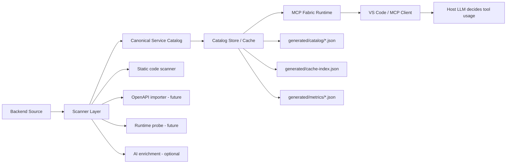
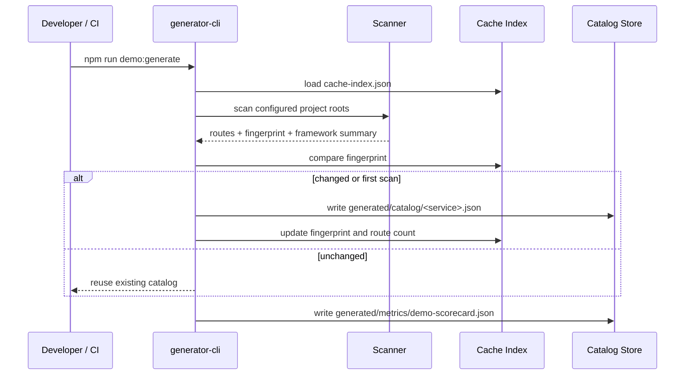
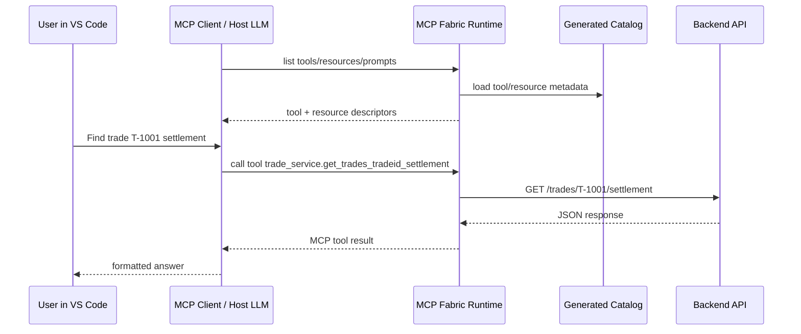
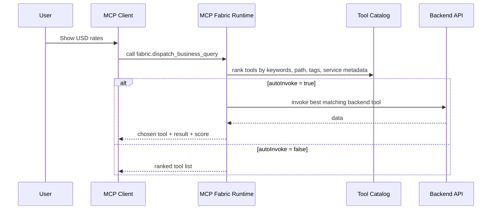
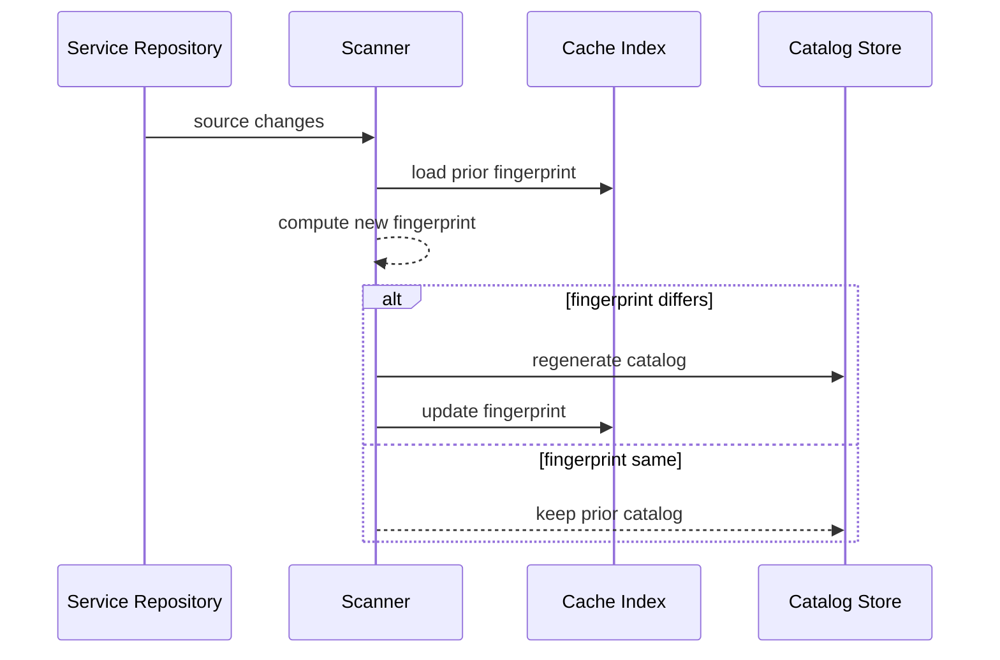

# MCP Fabric Architecture Document

## 1. Purpose

MCP Fabric is a generic platform that scans existing backend services, normalizes their API contracts into a reusable catalog, and exposes those capabilities through a generated MCP-compatible surface for clients such as VS Code.

The product goal is not to replace MCP decision-making. MCP standardizes how tools, resources, and prompts are exposed. MCP Fabric adds the intelligence required to make heterogeneous backends discoverable, describable, cacheable, and safe to consume.

## 2. Scope of the demo implementation

The demo implementation in this repository includes:

- 3 sample backend services
  - `trade-service` (Node/Express)
  - `money-market-service` (Node/Express)
  - `settlement-risk-spring` (Spring-style source + runnable mock service)
- a static scanner and catalog generator
- a file-based catalog/cache store
- a generic MCP Fabric runtime that exposes discovered APIs as MCP tools and resources
- a VS Code extension scaffold for Copilot or Ollama-assisted enrichment
- measurable demo metrics

## 3. Architecture principles

1. **Normalize before generating**  
   Never generate MCP directly from raw code. First build a canonical service catalog.

2. **Tools for execution, resources for context**  
   API operations become tools. Schemas, catalogs, examples, and metrics become resources.

3. **Client decides tool usage**  
   MCP Fabric improves tool quality; the host model still decides which tool to call.

4. **Cache unchanged services**  
   Use fingerprints so unchanged services are not rescanned.

5. **Keep orchestration optional**  
   `fabric_dispatch_business_query` is a convenience tool, not a protocol requirement.

## 4. High-level module view



## 5. Module responsibilities

### 5.1 Scanner layer

Current demo support:
- Express-style routes
- Spring annotations
- FastAPI decorators
- Nest decorators

Responsibilities:
- discover routes
- infer HTTP method and path
- infer path parameters
- derive stable tool names
- classify safe vs write operations
- collect framework/source file metadata
- produce a deterministic fingerprint

### 5.2 Canonical service catalog

The catalog is the intermediate model between source code and MCP.

Responsibilities:
- represent service metadata consistently across frameworks
- hold tool definitions
- hold resource URIs
- preserve assumptions and scan metadata
- become the source of truth for MCP generation

### 5.3 Catalog store / cache

The MVP uses JSON files so the demo runs with minimal setup.

Responsibilities:
- avoid rescanning unchanged projects
- keep generated catalogs portable
- preserve metrics for demo measurability

### 5.4 MCP Fabric runtime

Responsibilities:
- load all generated catalogs
- expose one MCP surface across many services
- map catalog operations to MCP tools
- map catalogs and metrics to MCP resources
- perform HTTP invocation against backend services
- optionally rank tools for natural-language routing

### 5.5 VS Code enrichment extension

Responsibilities:
- scan the current workspace
- call Copilot via VS Code Language Model API or local Ollama
- enrich catalogs with higher-quality descriptions and domain keywords
- write into the same catalog and cache format used by the generator

## 6. Canonical data model

### 6.1 Logical entities

- **Service** — one backend system
- **Operation** — one API route or callable capability
- **Resource** — read-only metadata, schema, catalog, examples
- **ScanRun** — one scan execution and fingerprint result
- **ToolVersion** — generated MCP-visible tool state
- **MetricSnapshot** — measurable demo output

### 6.2 JSON catalog shape used by the demo

```json
{
  "catalogVersion": "0.2.0",
  "serviceName": "trade-service",
  "serviceId": "trade-service",
  "baseUrl": "http://localhost:4010",
  "serviceType": "rest-api",
  "scannedAt": "2026-03-14T00:00:00Z",
  "rootDir": "apps/demo-services/trade-service",
  "domainKeywords": ["trade", "settlement"],
  "frameworkSummary": { "express": 6 },
  "resources": [
    {
      "uri": "catalog://service/trade-service",
      "name": "trade-service catalog",
      "mimeType": "application/json",
      "description": "Canonical catalog for trade-service"
    }
  ],
  "tools": [
    {
      "name": "get_trades_tradeid",
      "operationId": "get_trades_tradeid",
      "title": "get_trades_tradeid",
      "description": "GET /trades/{tradeId} from trade-service",
      "method": "GET",
      "path": "/trades/{tradeId}",
      "framework": "express",
      "sourceFile": "index.js",
      "safe": true,
      "riskLevel": "low",
      "tags": ["trades"],
      "resourceUris": [
        "catalog://service/trade-service",
        "catalog://tool/trade-service/get_trades_tradeid"
      ],
      "inputSchema": {
        "type": "object",
        "properties": { "tradeId": { "type": "string" } },
        "required": ["tradeId"]
      },
      "auth": { "type": "unknown", "inferred": false },
      "examples": {
        "invocation": { "query": {}, "note": "Populate path params and optional query fields." }
      }
    }
  ],
  "assumptions": ["Metadata was generated by static code scanning."],
  "scanMeta": {
    "scannedFiles": 3,
    "fingerprint": "sha1...",
    "generatedBy": "generator-cli"
  }
}
```

### 6.3 Production relational model

See `docs/data-model.sql` for a portable SQL version.

## 7. Sequence diagrams

### 7.1 Scan and catalog generation



### 7.2 MCP client uses generated tools



### 7.3 Optional dispatcher flow



### 7.4 Drift detection and rescan



## 8. Deployment options

### Option A: One Fabric runtime for many services

Pros:
- easier rollout
- one MCP endpoint to configure
- centralized governance

Cons:
- larger tool surface
- more work to keep descriptions and tags high quality

### Option B: One MCP server per service

Pros:
- cleaner ownership boundary
- easier least-privilege isolation

Cons:
- more MCP server instances to manage
- more client configuration

The demo implements **Option A**.

## 9. Demo backend services

### trade-service
Use cases:
- trade lookup
- settlement lookup
- trade search
- portfolio positions

### money-market-service
Use cases:
- rate lookup
- deal search
- instrument lookup
- counterparty limit lookup

### settlement-risk-spring
Use cases:
- counterparty lookup
- limit lookup
- exposure lookup
- breach search

This service intentionally includes Spring-style Java annotations for scanning and a Node mock server for easy local execution.

## 10. Security and governance considerations

Not fully implemented in the demo, but required for production:
- auth inference and explicit auth declarations
- per-tool allow/deny policy
- read-only vs write approval workflow
- masking or redaction for sensitive fields
- audit log of tool invocations
- versioned catalogs and drift alerts

## 11. Metrics for demo measurability

The demo exposes:
- services scanned
- routes discovered
- tools generated
- cache hits / misses
- framework breakdown
- scan duration
- routing confidence examples

These are written to `generated/metrics/demo-scorecard.json` and also exposed as `catalog://metrics`.

## 12. Implementation map in this repository

- `tools/generator-cli` — scanner and catalog generation
- `generated/catalog` — persisted service catalogs
- `generated/cache-index.json` — scan cache
- `apps/mcp-fabric-server` — MCP runtime over generated catalogs
- `apps/demo-services/*` — sample backend services
- `apps/vscode-extension` — workspace enrichment using Copilot or Ollama
- `tools/smoke-test` — quick verification of the sample APIs

## 13. Next production steps

1. Import OpenAPI first, scan code second, use LLM only for gaps.
2. Move from file store to SQLite or Postgres.
3. Add auth policy inference and per-tool approval states.
4. Add response schema validation using observed runtime responses.
5. Add semantic ranking over operation descriptions and examples.
6. Add per-service generated MCP servers in addition to the shared Fabric runtime.
